# ОРБИТА.QC

**От признака дефекта — к обоснованному решению.**

Пять рабочих мест. Единая история изделия. Контроль, доработка и исследование причин в одном процессе.

[Рабочие места](#работа-начинается-с-роли) · [Архитектура](#архитектура) · [Данные](#данные-происхождение-и-состав) · [Быстрый старт](#быстрый-старт)

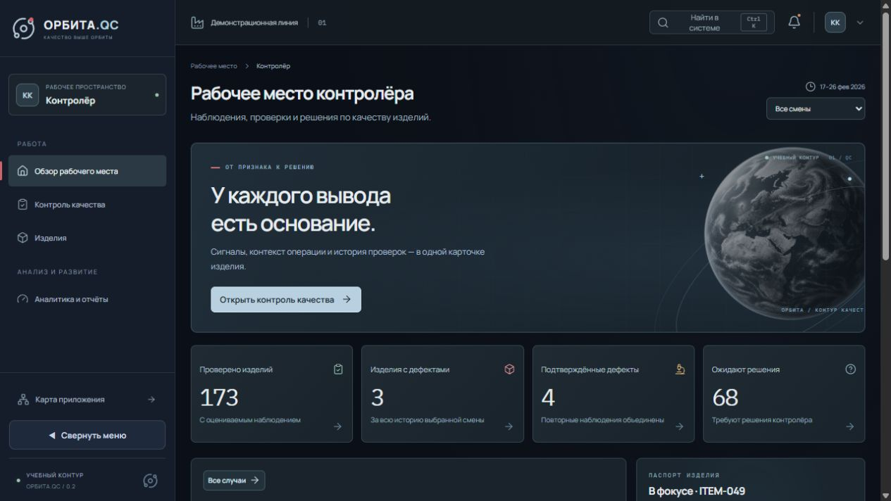

Рабочая среда контроля качества: от наблюдения на производственной линии до решения ОТК, выполнения работы мастером и исследования причины дефекта. История изделия объединяет события контроля, операции, оборудование, исполнителей, фотографии и человеческие выводы. Каждый вывод можно проследить до его оснований.

## Как устроен рабочий процесс

Система разделяет три разных вопроса: **что наблюдали, что подтвердил контроль и почему возникла проблема**. Сигнал камеры запускает проверку, но сам по себе не означает брак. Контролёр изучает основания и направляет действие мастеру. Мастер выполняет работу, прикладывает результат и возвращает изделие на повторный контроль либо предлагает списание. Последнее слово о годности остаётся за ОТК.

Технолог исследует причину параллельно: связывает дефект с условиями операции, сравнивает факты и запрашивает недостающие сведения. Руководитель видит последствия для программы и согласует управленческие меры. Администратор обеспечивает доставку и сохранность записей. Действия соединены ссылками на изделие, исходный случай и автора — задача следующей роли возникает из сохранённого результата предыдущей.

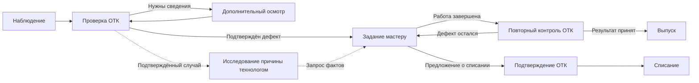
```mermaid
flowchart LR
  Signal[Наблюдение] --> QC[Проверка ОТК]
  QC -->|Нужны сведения| Check[Дополнительный осмотр]
  Check --> QC
  QC -->|Подтверждён дефект| Master[Задание мастеру]
  Master -->|Работа завершена| Repeat[Повторный контроль ОТК]
  Repeat -->|Дефект остался| Master
  Repeat -->|Результат принят| Release[Выпуск]
  Master -->|Предложение о списании| ScrapQC[Подтверждение ОТК]
  ScrapQC --> Scrap[Списание]
  QC -. Подтверждённый случай .-> Tech[Исследование причины технологом]
  Tech -. Запрос фактов .-> Master
```

## Работа начинается с роли

Контролёру нужен сигнал, его основания и допустимые дальнейшие действия. Мастеру — задания участка и ожидаемый результат. Технологу — обстоятельства возникновения дефекта. Руководителю — показатели и управленческие меры. Администратору — обмен, доступ, хранение и диагностика.

Такое разделение сокращает посторонний информационный шум. Контролёр не получает инструменты администрирования; технолог не принимает производственные решения о детали. Сервер проверяет роль и доступные линии независимо от того, какие кнопки показаны в браузере.

| Рабочее место | Что видит и делает | Где сохраняется результат |
| --- | --- | --- |
| Контролёр | Очередь сигналов, кадры до/после, паспорт и основания. Записывает очный контроль и замеры; подтверждает либо отклоняет признак, направляет на проверку/доработку, удерживает, выпускает или подтверждает списание | Неизменяемое событие в `events`, журнал изделия, квитанция команды; решение также попадает в `outbox` |
| Мастер | Получает задания от ОТК, фиксирует метод, исполнителя, длительность и результат, прикрепляет фото, возвращает изделие на контроль либо предлагает списание. Отвечает на запросы о состоянии инструмента и оснастки | События `master_action` и `master_process_report`; фото в media DB; ссылки и история в основной DB |
| Технолог | Анализирует подтверждённые случаи, сравнивает операции и телеметрию, проверяет альтернативы, запрашивает сведения. Сохраняет гипотезу, установленную или неустановленную причину | Отдельные `cause_review` и `evidence_request`; черновики и чек-листы — в серверных настройках пользователя |
| Руководитель | Изучает качество, повторяемость, потери и состояние оборудования, формирует отчёты, визирует управленческие меры | Визы, подпись и аудит на сервере; задания доставки — в отдельной очереди |
| Администратор | Контролирует приём событий, ошибки, ERP/MES/CAD, сеансы, целостность истории, резервные копии и повторную доставку | Квитанции приёма, состояния адаптеров, аудит и результаты диагностики |

### Контролёр: факт, проверка, решение

В очереди отдельный случай связан с изделием, компонентом, зоной и наблюдениями. Повторные доставки не увеличивают количество дефектов. Карточка показывает наблюдение, обстоятельства операции и подтверждающие материалы. Отсутствующий кадр остаётся отсутствующим; ограниченный обзор не превращается в подтверждённый дефект.

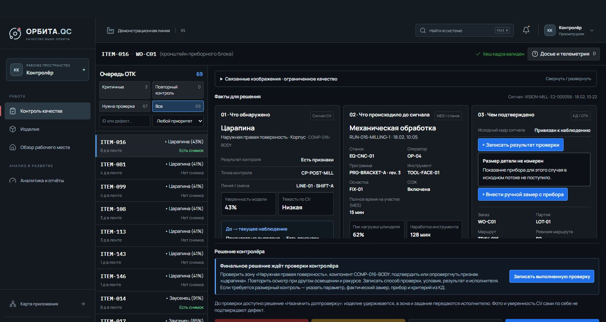

*Снимки показывают синтетические данные. Основные экраны сняты с публичного стенда; показатели меняются по мере действий пользователей. Галереи под таблицами раскрывают все перечисленные вкладки.*

Три результата наблюдения различаются явно: «Есть признаки», «Признаков не выявлено», «Оценить невозможно». При необходимости контролёр записывает очный осмотр или приборный замер с идентификатором прибора и основанием допуска. Уверенность CV, размер видимого следа и телеметрия станка сами по себе не являются поверенным измерением детали.


| Раздел / вкладка | Для чего нужен и что реализовано | Экран |
| --- | --- | --- |
| Обзор рабочего места | Очередь внимания, текущие показатели, переход к случаю и паспорту помогают начать смену с незавершённых проверок. | [Открыть](docs/screenshots/controller-home.png) |
| Контроль качества · Сигналы | Фильтры критичности, работы мастера и повторного контроля. Карточка объединяет наблюдение, фото и допустимые решения ОТК. | [Открыть](docs/screenshots/controller-quality.png) |
| Аналитика · Сводка ОТК | Показывает объём контроля и незавершённые рассмотрения в выбранном периоде и смене. | [Открыть](docs/screenshots/controller-analytics.png) |
| Аналитика · Изделия и дефекты | Отделяет количество изделий от количества дефектов, раскрывает повторяемость и состав случаев. | [Открыть](docs/screenshots/controller-defects.png) |
| Аналитика · Решения | Позволяет проверить, какие случаи рассмотрены и какой результат записан ОТК. | [Открыть](docs/screenshots/controller-decisions.png) |
| Аналитика · Качество наблюдений | Отражает пригодность данных и ограничения обзора, чтобы отсутствие достоверного наблюдения не считалось отсутствием дефекта. | [Открыть](docs/screenshots/controller-sources.png) |
| Аналитика · Отчёты | Формирует документ по выбранному срезу с автором и составом разделов. | [Открыть](docs/screenshots/controller-reports.png) |

<details>
<summary>Посмотреть все экраны этого рабочего места</summary>

**Обзор рабочего места**


**Контроль качества · Сигналы**

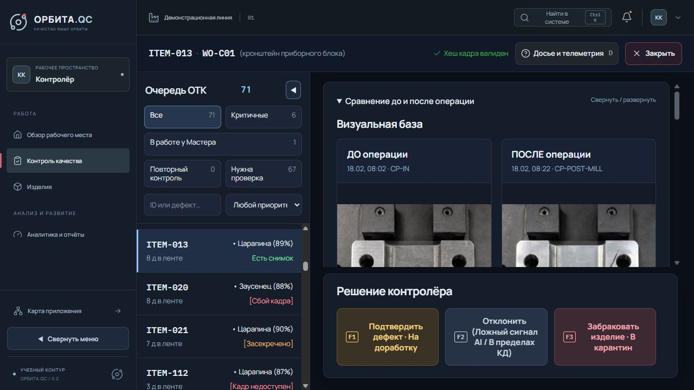

**Аналитика · Сводка ОТК**

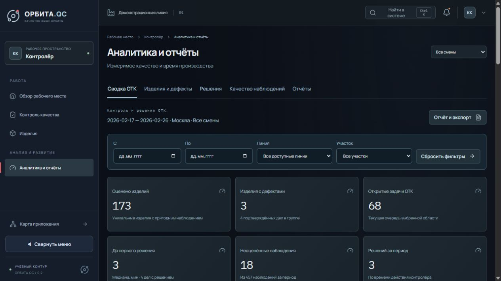

**Аналитика · Изделия и дефекты**

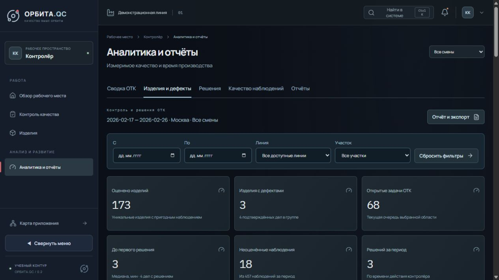

**Аналитика · Решения**

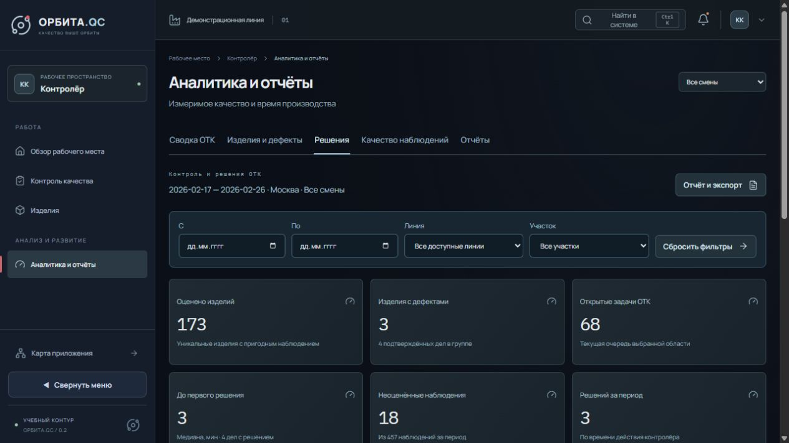

**Аналитика · Качество наблюдений**

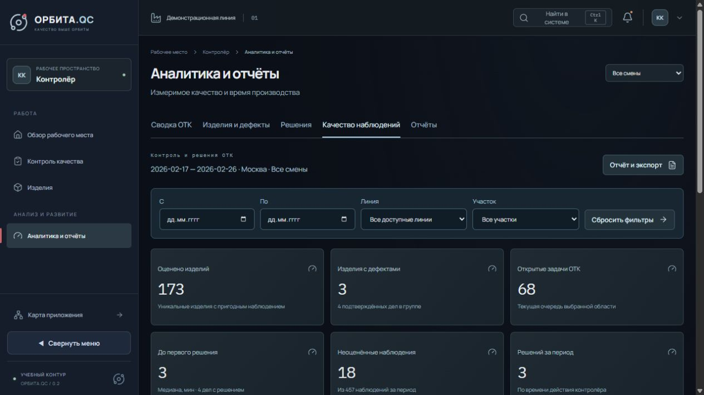

**Аналитика · Отчёты**

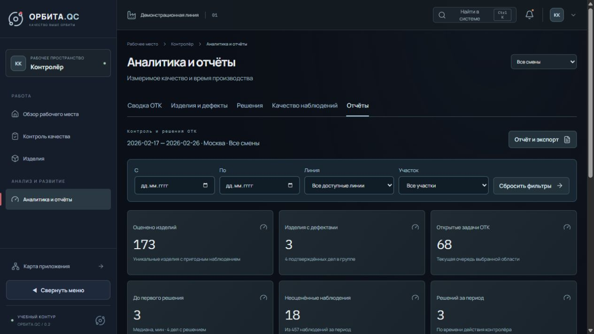

</details>

### Мастер: Пульт участка — выполнить и вернуть в ОТК

Направление контролёра создаёт задачу мастера из истории событий. Мастер записывает выполненную работу и передаёт результат на повторный контроль. Можно загрузить PNG, JPEG или WebP до 12 МиБ: сервер проверяет формат, рассчитывает SHA-256, шифрует файл и сохраняет его отдельно от текстовых данных. При отсутствии фотографии фиксируется основание очного осмотра.

Мастер может предложить списание и передать деталь в изолятор. Это создаёт задачу контролёру; окончательное решение о списании принимает ОТК. Завершение работы мастером не означает автоматический выпуск.


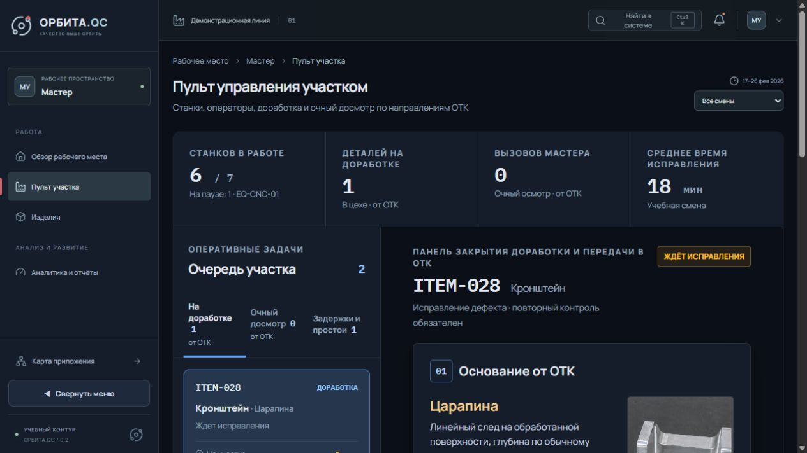

Главный экран мастера — **Пульт участка**: здесь находятся очередь заданий, карточка изделия и действия по выполнению работы. Обзор смены доступен отдельной вкладкой и описан ниже.

| Раздел / вкладка | Для чего нужен и что реализовано | Экран |
| --- | --- | --- |
| Обзор рабочего места | Сводит открытые направления, состояние участка и очереди работ. | [Открыть](docs/screenshots/master-home.png) |
| Пульт участка · Доработка | Задание ОТК, метод исправления, исполнитель, длительность, результат и фото. Передача обратно контролёру сохраняется в истории. | [Открыть](docs/screenshots/master-terminal.png) |
| Пульт участка · Очный досмотр | Показывает запросы дополнительного осмотра; пустая очередь означает отсутствие таких направлений в текущем срезе. | [Открыть](docs/screenshots/master-inspection.png) |
| Пульт участка · Задержки | Выделяет незавершённые операции и ожидания, чтобы мастер мог разбирать причины задержки участка. | [Открыть](docs/screenshots/master-delays.png) |
| Аналитика · Сводка участка | Объединяет операции, открытые действия и показатели выбранной смены. | [Открыть](docs/screenshots/master-analytics.png) |
| Аналитика · Операции и время | Сравнивает длительности и завершённость по фактам начала и окончания операций. | [Открыть](docs/screenshots/master-time.png) |
| Аналитика · Доработка | Показывает повторные обработки и их результат, не смешивая их с первоначальным проходом. | [Открыть](docs/screenshots/master-rework.png) |
| Аналитика · Передача смены | Собирает незавершённые действия и ожидания для следующей смены. | [Открыть](docs/screenshots/master-handover.png) |
| Аналитика · Качество участка | Связывает контроль с операциями участка и позволяет увидеть повторяемость. | [Открыть](docs/screenshots/master-quality.png) |
| Аналитика · Отчёты | Фиксирует выбранный срез участка в отчёте. | [Открыть](docs/screenshots/master-reports.png) |

<details>
<summary>Посмотреть все экраны этого рабочего места</summary>

**Обзор рабочего места**

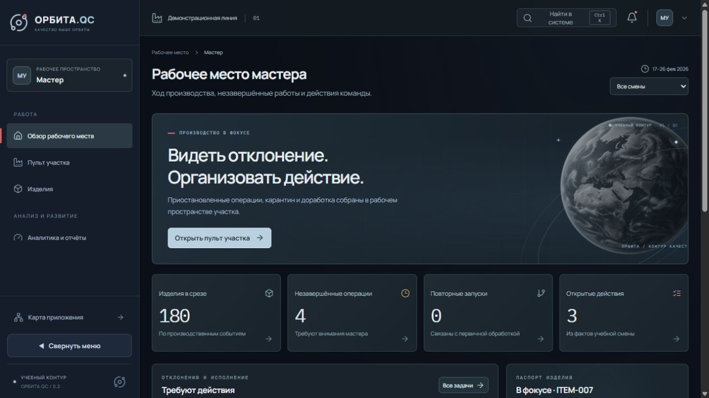

**Пульт участка · Доработка**


**Пульт участка · Очный досмотр**

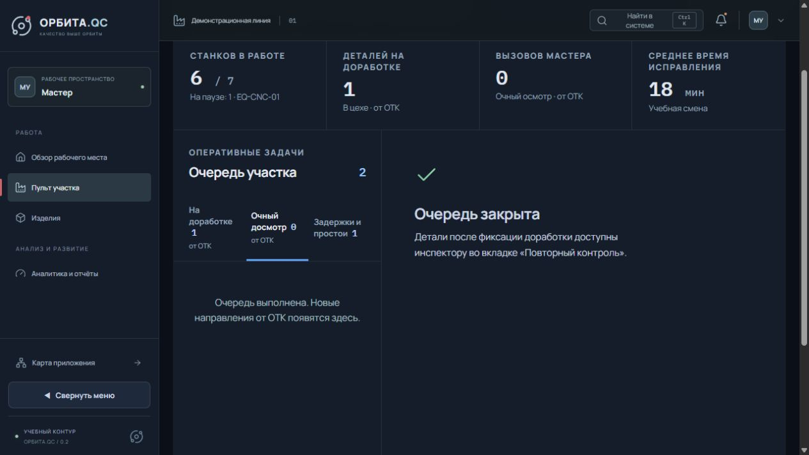

**Пульт участка · Задержки**

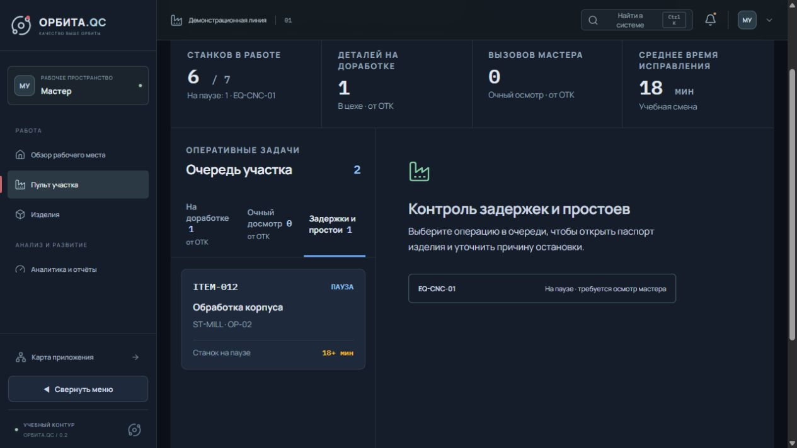

**Аналитика · Сводка участка**

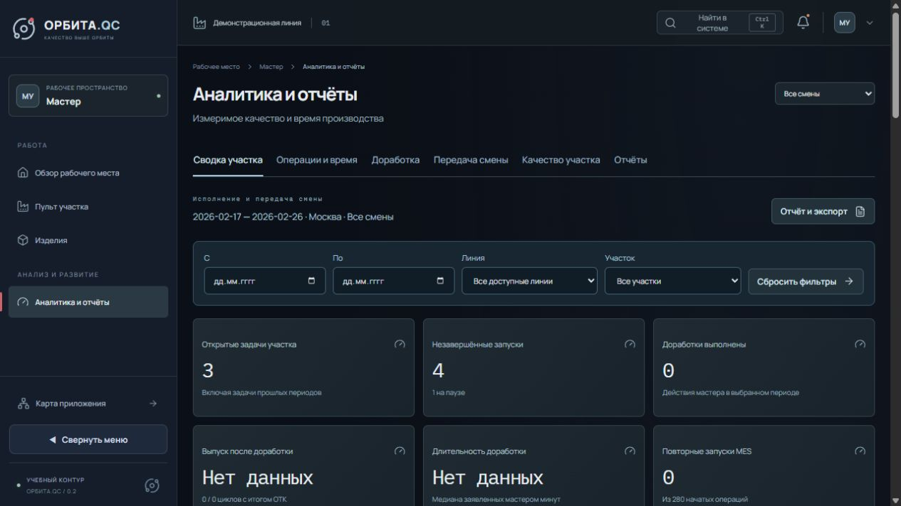

**Аналитика · Операции и время**

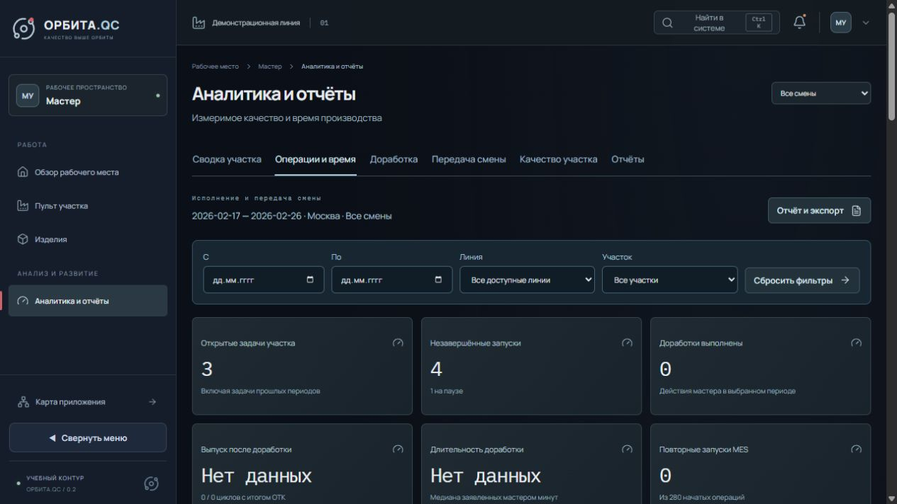

**Аналитика · Доработка**

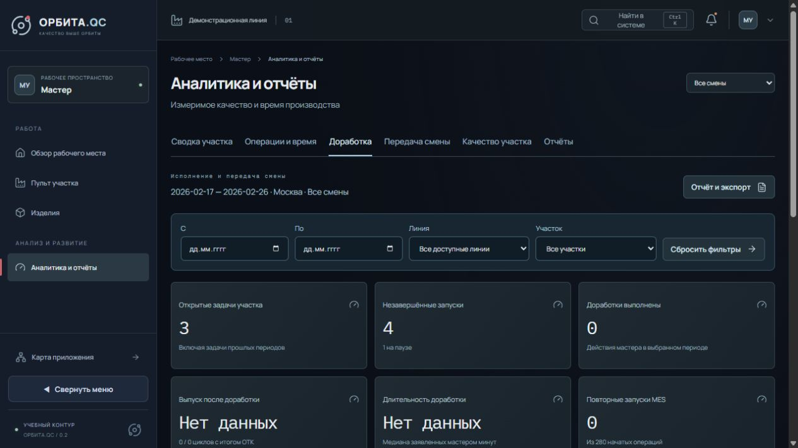

**Аналитика · Передача смены**

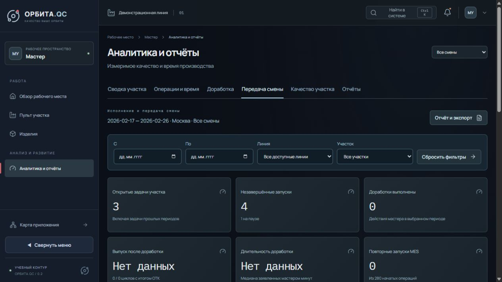

**Аналитика · Качество участка**

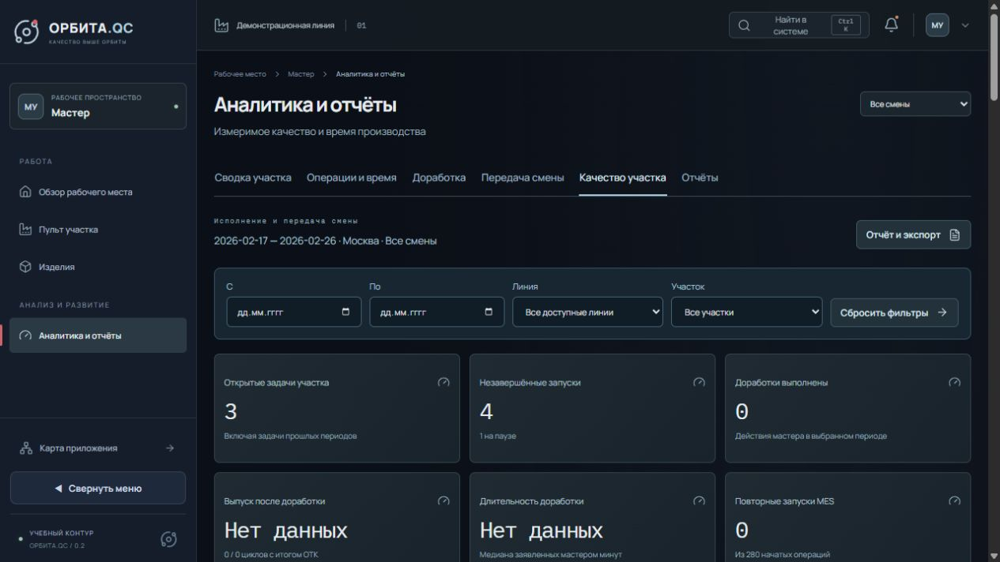

**Аналитика · Отчёты**

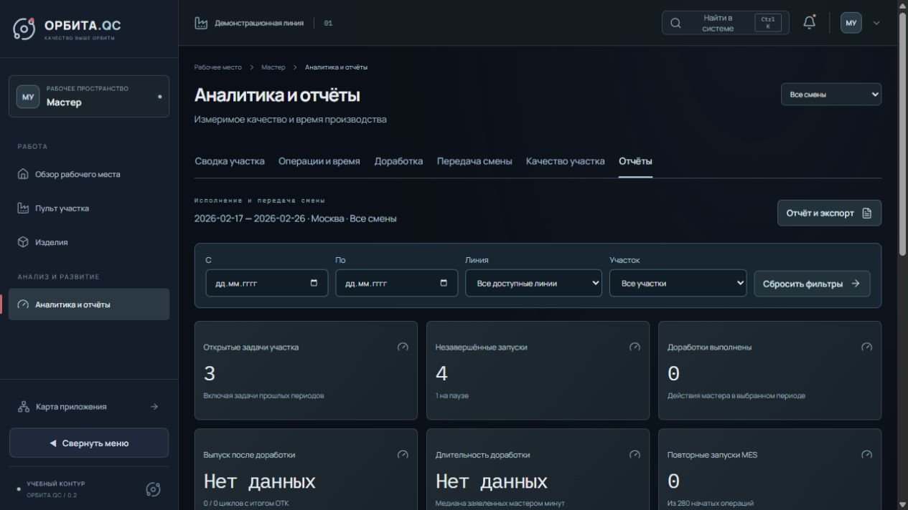

</details>

### Технолог: найти причину

Расследование сопоставляет входной и последующий контроль, конкретный запуск операции, станок, оператора, программу, инструмент, наладку и телеметрию. Можно сравнивать похожие операции, просматривать исходные сообщения, запрашивать пояснения мастера или результат проверки ОТК.

Заключение содержит выбранные основания, альтернативные объяснения и недостающие сведения. «Причина не установлена» — полноценный результат. Новые факты могут потребовать пересмотра вывода, при этом прежняя версия сохраняется. Связь со станком или оператором по времени не доказывает виновность. **Технолог не разрешает доработку, не выпускает и не списывает детали.**

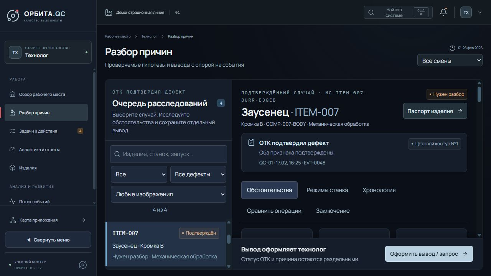

На стенде последовательно открыты все рабочие экраны технолога. Ниже сразу показаны ключевые вкладки расследования и аналитики; каждая связана с отдельным снимком и пояснением.

| Обстоятельства | Режимы станка | Хронология |
| --- | --- | --- |
|  | 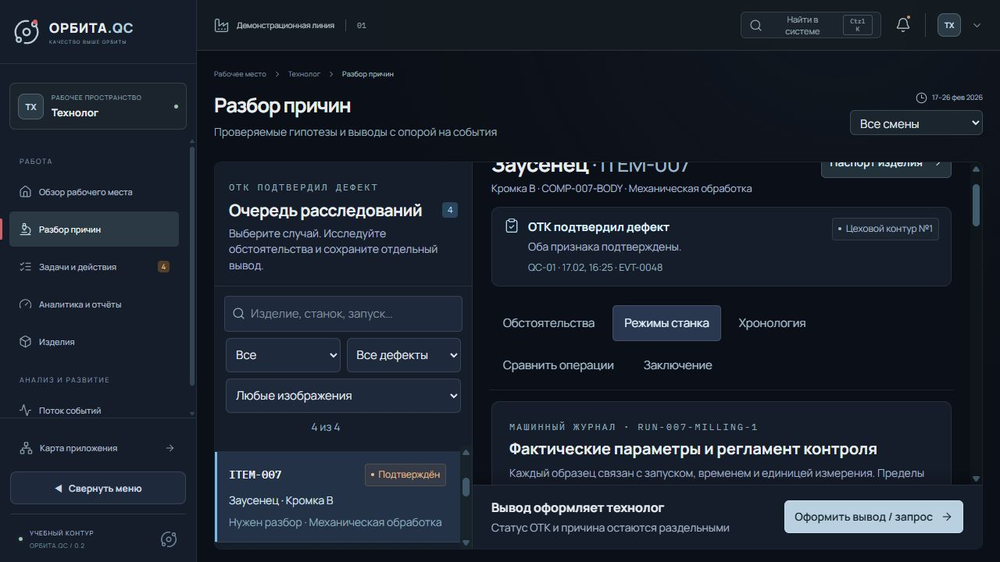 | 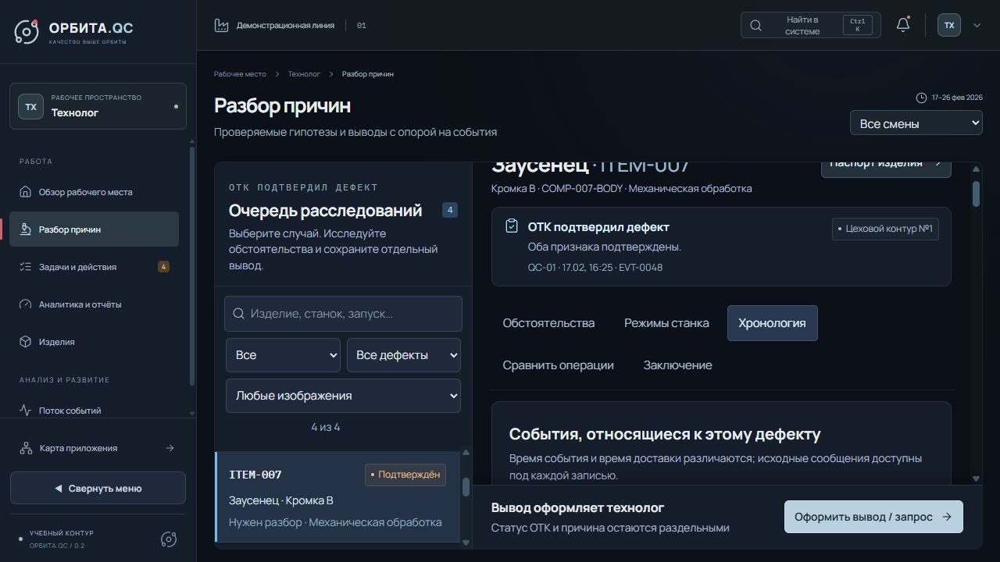 |

| Сравнить операции | Заключение | Аналитика |
| --- | --- | --- |
| 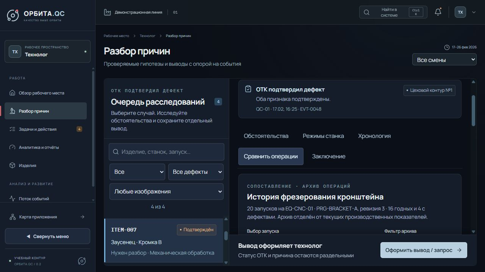 | 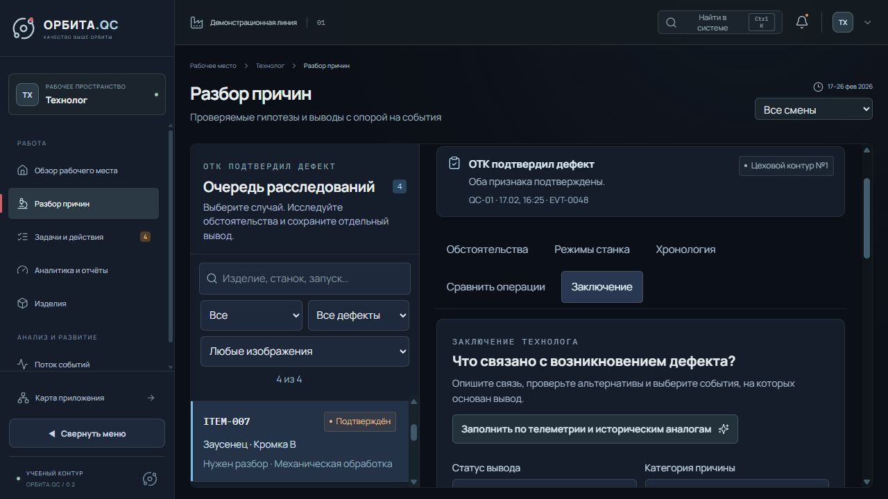 | 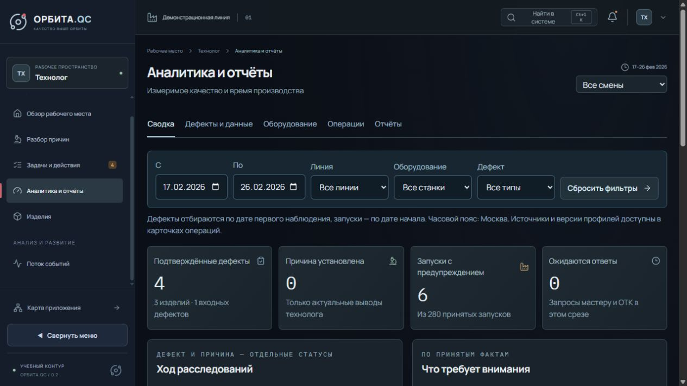 |

| Раздел / вкладка | Для чего нужен и что реализовано | Экран |
| --- | --- | --- |
| Обзор рабочего места | Показывает подтверждённые случаи, состояние исследований и запросы сведений. | [Открыть](docs/screenshots/technologist-home.png) |
| Разбор причин · Обстоятельства | Сводит изделие, операцию, оборудование, инструмент, наладку и основания. | [Открыть](docs/screenshots/technologist-investigation.png) |
| Разбор причин · Режимы станка | Сопоставляет телеметрию с временным интервалом конкретного запуска. | [Открыть](docs/screenshots/technologist-machine.png) |
| Разбор причин · Хронология | Восстанавливает последовательность фактов, отделяя время события от времени доставки. | [Открыть](docs/screenshots/technologist-timeline.png) |
| Разбор причин · Сравнить операции | Помогает проверить повторяемость и альтернативные объяснения на похожих запусках. | [Открыть](docs/screenshots/technologist-compare.png) |
| Разбор причин · Заключение | Сохраняет гипотезу, основания и ограничения вывода. Не меняет производственный допуск детали. | [Открыть](docs/screenshots/technologist-conclusion.png) |
| Задачи и действия · Мои задачи | Собирает случаи, требующие исследования, и следующие шаги по сбору фактов. | [Открыть](docs/screenshots/technologist-tasks.png) |
| Аналитика · Сводка | Показывает ход расследований, полноту оснований и дела в выбранном срезе. | [Открыть](docs/screenshots/technologist-analytics.png) |
| Аналитика · Дефекты и данные | Выделяет повторяющиеся типы дефектов и достаточность наблюдений. | [Открыть](docs/screenshots/technologist-defects.png) |
| Аналитика · Оборудование | Сопоставляет запуски, оценённый контроль и предупреждения с явными знаменателями. Совпадение не доказывает причину. | [Открыть](docs/screenshots/technologist-equipment.png) |
| Аналитика · Операции | Показывает завершённость, длительность и повторные проходы по операциям и станкам. | [Открыть](docs/screenshots/technologist-operations.png) |
| Аналитика · Отчёты | Сохраняет выбранный состав аналитического отчёта о качестве и обстоятельствах производства. | [Открыть](docs/screenshots/technologist-reports.png) |

<details>
<summary>Посмотреть все экраны этого рабочего места</summary>

**Обзор рабочего места**

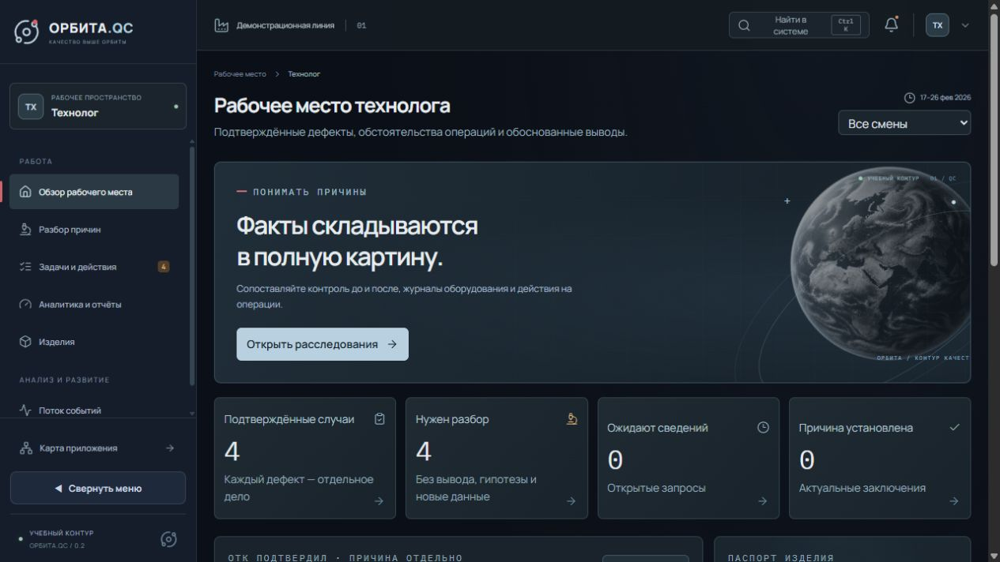

**Разбор причин · Обстоятельства**


**Разбор причин · Режимы станка**


**Разбор причин · Хронология**


**Разбор причин · Сравнить операции**


**Разбор причин · Заключение**


**Задачи и действия · Мои задачи**

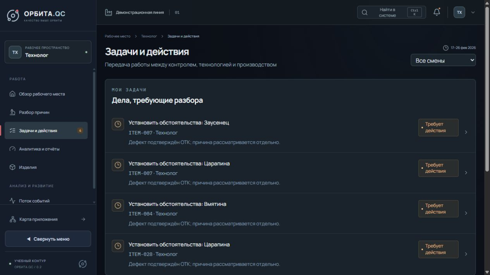

**Аналитика · Сводка**


**Аналитика · Дефекты и данные**

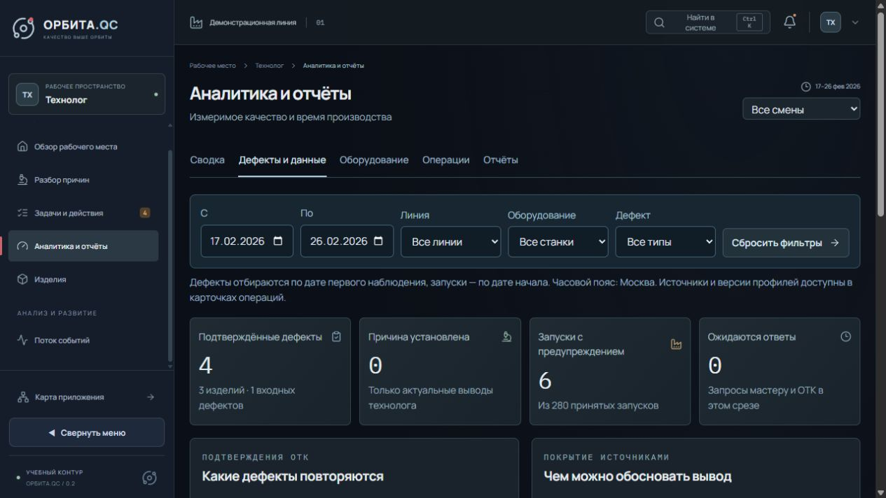

**Аналитика · Оборудование**

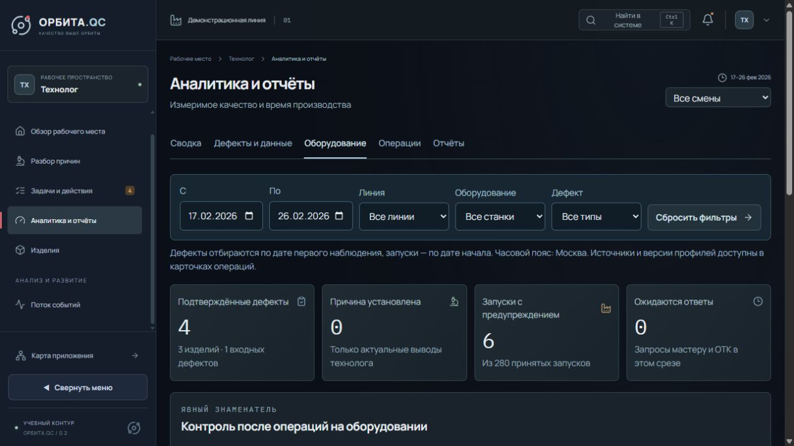

**Аналитика · Операции**

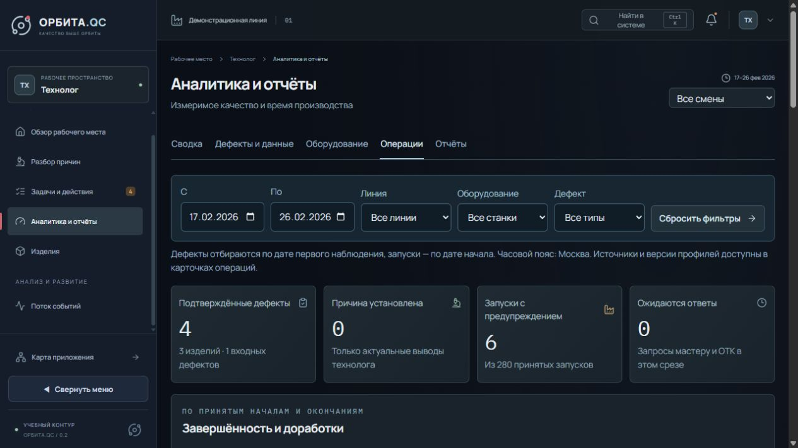

**Аналитика · Отчёты**

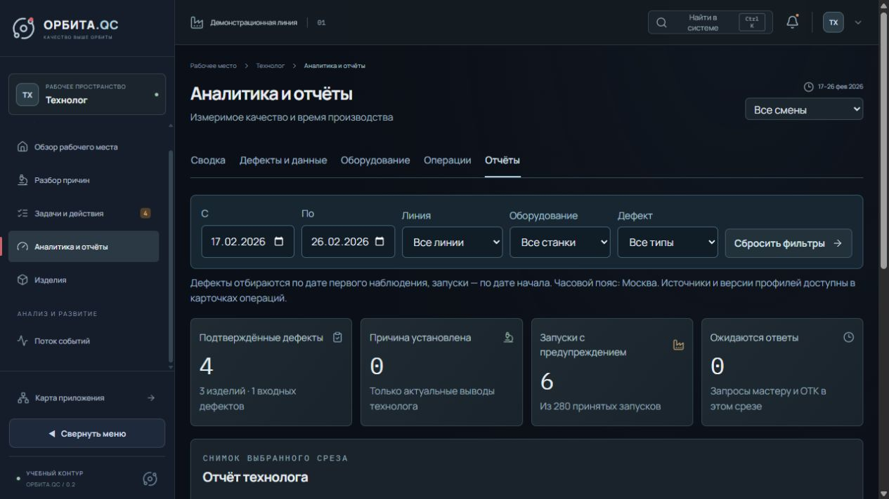

</details>

### Руководитель: от показателя к мероприятию

Рабочее место объединяет производственную программу, повторяемость дефектов, Парето, доработки и надёжность оборудования. Паспорт позволяет перейти от сводного показателя к истории конкретного изделия.

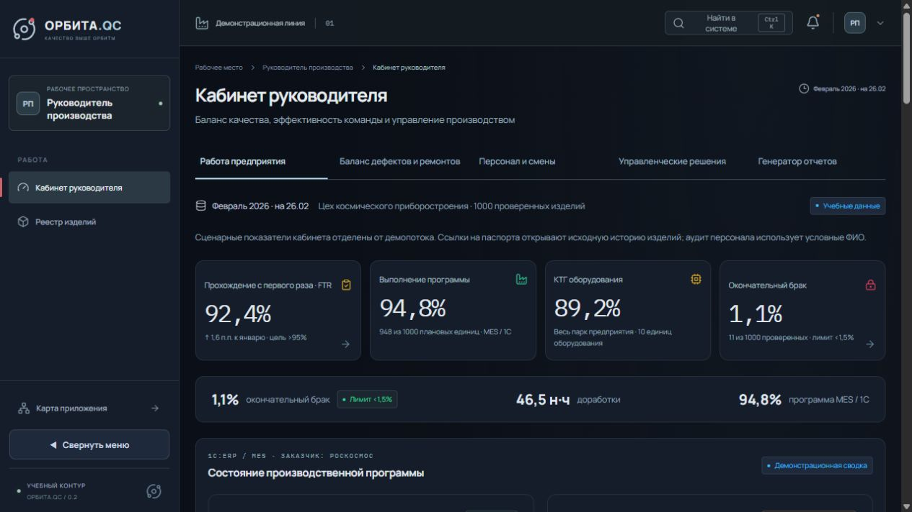

Месячная сводка руководителя — отдельный синтетический сценарий на 1000 изделий. Она явно отделена от оперативной выборки на 180 изделий и не выдаётся за текущую выгрузку ERP. Оперативные ролевые отчёты строятся из принятых событий. Визы руководителя сохраняются сервером с ECDSA-подписью и аудитом; доставка во внутренний журнал получателя проходит через очередь. Юридически значимая КЭП и подключение внешнего документооборота требуют инфраструктуры предприятия.


| Раздел / вкладка | Для чего нужен и что реализовано | Экран |
| --- | --- | --- |
| Работа предприятия | Программа, FTR, Парето, тепловая карта, надёжность оборудования и переходы к исходным паспортам. | [Открыть](docs/screenshots/leader-overview.png) |
| Баланс дефектов и ремонтов | Выявление, восстановление, изолятор, трудозатраты и повторные доработки показывают стоимость проблемы. | [Открыть](docs/screenshots/leader-balance.png) |
| Персонал и смены | Сравнение смен и показателей работы ролей помогает выделить отклонения. ФИО условные; совпадение показателей не устанавливает вину работника. | [Открыть](docs/screenshots/leader-personnel.png) |
| Управленческие решения | Визы по рекламации, наряду ОГМ и маршруту доработки: основания, подпись, автор, время и очередь передачи. Виза не заменяет выпуск ОТК. | [Открыть](docs/screenshots/leader-actions.png) |
| Генератор отчётов | Три печатных бланка: справка о качестве, рекламационный акт и ведомость фонда времени. Фильтры периода и заказа, предпросмотр и PDF через печать браузера. | [Открыть](docs/screenshots/leader-reports.png) |

<details>
<summary>Посмотреть все экраны этого рабочего места</summary>

**Работа предприятия**


**Баланс дефектов и ремонтов**

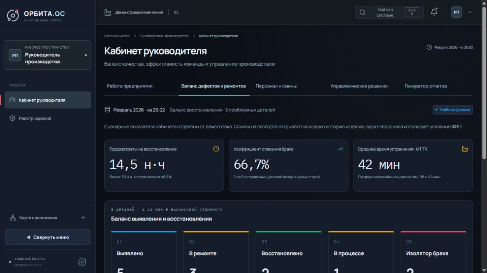

**Персонал и смены**

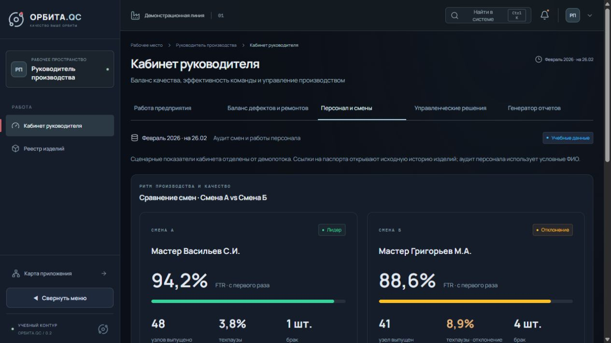

**Управленческие решения**

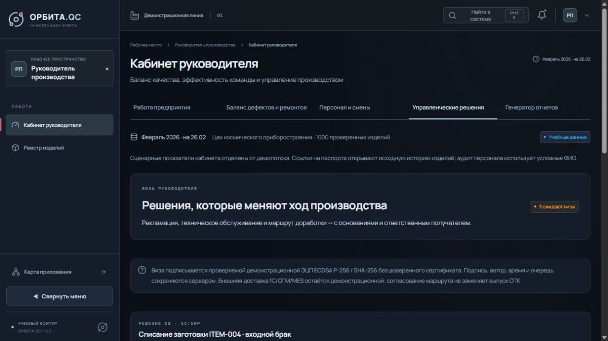

**Генератор отчётов**

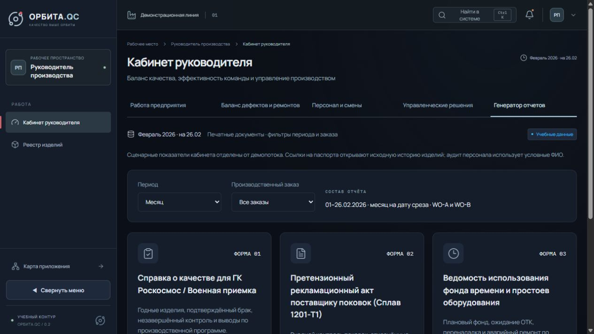

</details>

### Администратор: увидеть сбой и восстановить обмен

Экран диагностики читает состояние БД, сеансов и очередей. Отдельно доступны ошибки приёма, журнал действий, проверка HMAC-цепочек, создание резервной копии, отзыв сеанса и повтор неуспешной доставки. Ненастроенный внешний адаптер отображается как ненастроенный. Просмотр экранов не подменяет результат настоящего сетевого обмена.

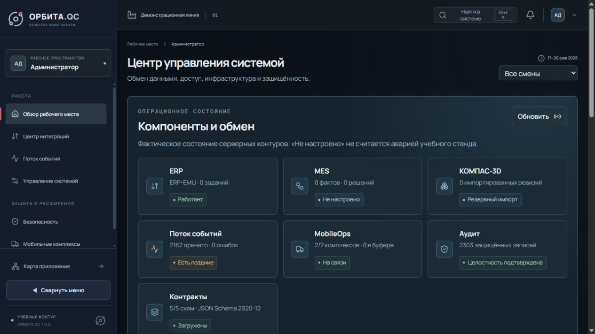


| Раздел / вкладка | Для чего нужен и что реализовано | Экран |
| --- | --- | --- |
| Обзор рабочего места | Состояние компонентов, журнал приёма и переходы к проблемам обмена. | [Открыть](docs/screenshots/admin-home.png) |
| Интеграции · Подключения | Профили 1С, Галактики, MES и КОМПАС с направлениями обмена и условиями подключения. | [Открыть](docs/screenshots/admin-integrations.png) |
| Интеграции · Журнал обмена | Получение задания ERP и передача результата с квитанциями, идемпотентностью и повторами. На стенде работает ERP-эмулятор. | [Открыть](docs/screenshots/admin-exchange.png) |
| Интеграции · MES без повторного ввода | Факты операций и отправка решений ОТК через настроенный шлюз; на публичном стенде внешняя MES не подключена. | [Открыть](docs/screenshots/admin-mes.png) |
| Интеграции · Сопоставления | Связи внешних и внутренних ID полученных заказов. Неизвестные идентификаторы отклоняются. | [Открыть](docs/screenshots/admin-mappings.png) |
| Интеграции · КОМПАС и сборки | Импорт структуры и ревизии из JSON либо SDK-шлюза. Геометрия не передаётся. | [Открыть](docs/screenshots/admin-cad.png) |
| Интеграции · Контракты и API | Исполняемые JSON Schema, версии и контрольные суммы — без раскрытия секретов. | [Открыть](docs/screenshots/admin-contracts.png) |
| Управление · Пользователи и роли | Матрица ответственности и серверные сеансы с возможностью отзыва. | [Открыть](docs/screenshots/admin-users.png) |
| Управление · Источники и Edge | Схема движения данных. Управление промышленными Edge-агентами пока запланировано. | [Открыть](docs/screenshots/admin-topology.png) |
| Управление · Состояние системы | Фактическая диагностика сервера, очередей, аудита, БД и копий с периодическим обновлением. | [Открыть](docs/screenshots/admin-health.png) |
| Управление · Нагрузка и устойчивость | Интерфейс нагрузочных испытаний пока запланирован. Выполненные проверки запускаются скриптами и описаны в протоколе. | [Открыть](docs/screenshots/admin-scale.png) |
| Управление · Модули и расширения | Описана точка развития подключаемых модулей. Регистрация модулей через этот экран пока не подключена. | [Открыть](docs/screenshots/admin-extensions.png) |
| Управление · Справочники | Показана будущая рабочая область версионирования каталогов. Текущие каталоги загружаются при инициализации. | [Открыть](docs/screenshots/admin-catalogs.png) |
| Безопасность · Аудит действий | Критические действия, отказы, авторство и основания в серверном журнале. | [Открыть](docs/screenshots/admin-audit.png) |
| Безопасность · Целостность | Проверка HMAC-цепочек неизменяемой истории; отображается результат серверной проверки. | [Открыть](docs/screenshots/admin-integrity.png) |
| Безопасность · Ключи и криптопрофили | Активный профиль и порядок офлайн-ротации keyring с сохранением доступа к старой истории. | [Открыть](docs/screenshots/admin-crypto.png) |
| Безопасность · Модель угроз+ | Расширенный интерфейс анализа угроз запланирован. Реализованный архивный криптопрофиль доступен через CLI. | [Открыть](docs/screenshots/admin-threats.png) |
| Безопасность · Резервирование | Создание копии обеих БД с проверкой манифеста; ключи резервируются отдельно. | [Открыть](docs/screenshots/admin-backup.png) |
| Мобильные комплексы · Задания | Учебные задания на осмотр и сохранение наблюдений сервером. | [Открыть](docs/screenshots/admin-missions.png) |
| Мобильные комплексы · Комплексы | Эмулятор устройств и состояния связи для проверки доставки. Реальный робот не подключён. | [Открыть](docs/screenshots/admin-robots.png) |
| Мобильные комплексы · Связь и синхронизация | Буфер, подтверждения и доставка накопленных наблюдений после восстановления связи. | [Открыть](docs/screenshots/admin-connectivity.png) |

<details>
<summary>Посмотреть все экраны этого рабочего места</summary>

**Обзор рабочего места**


**Интеграции · Подключения**

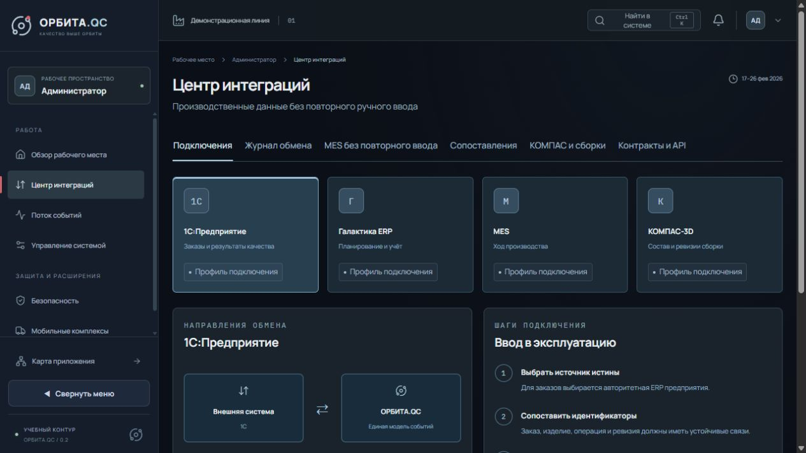

**Интеграции · Журнал обмена**

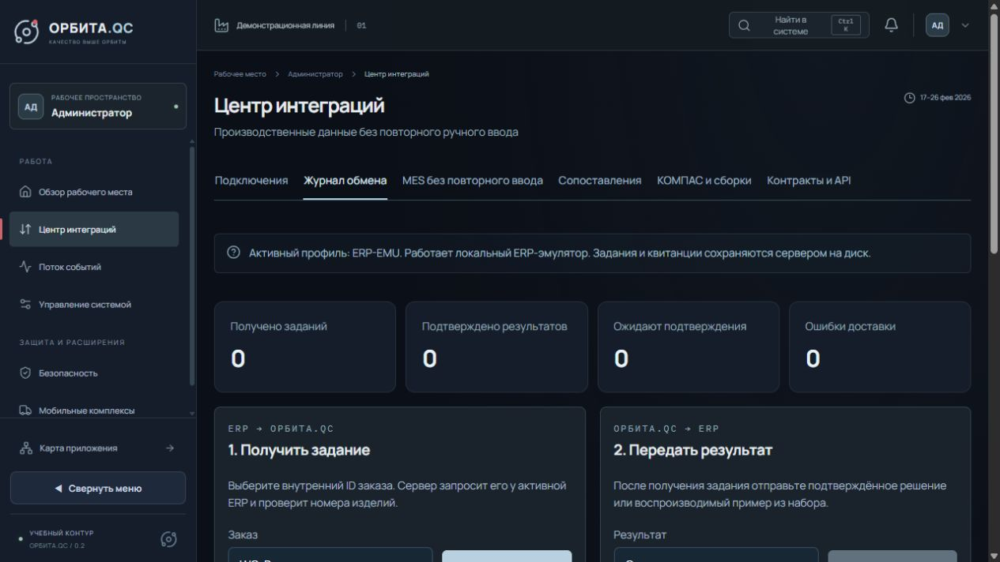

**Интеграции · MES без повторного ввода**

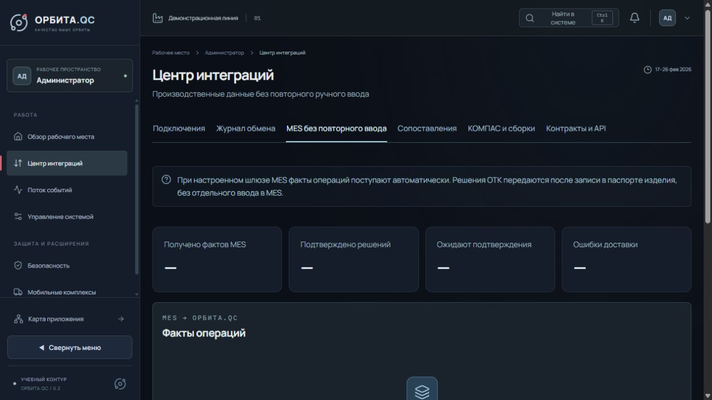

**Интеграции · Сопоставления**

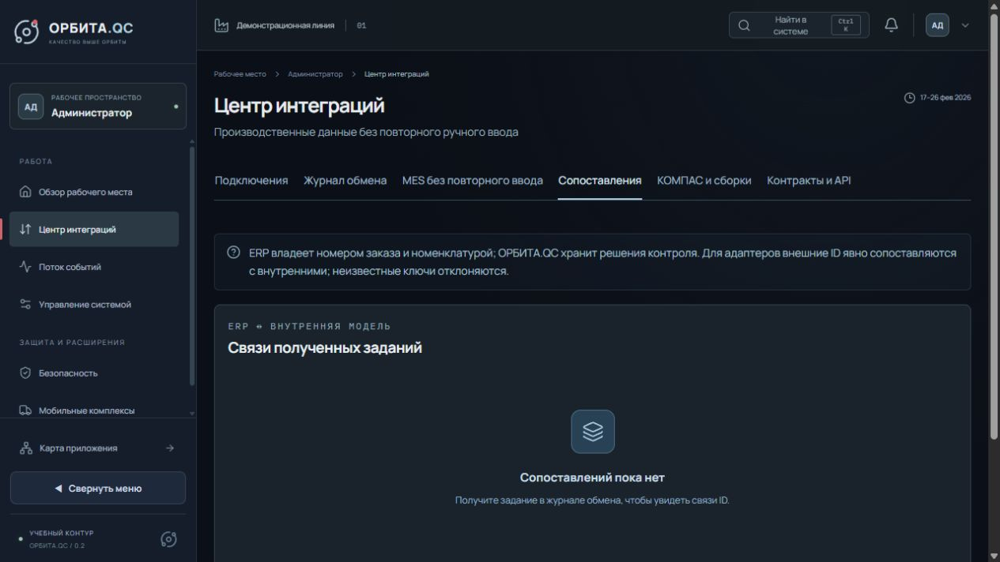

**Интеграции · КОМПАС и сборки**

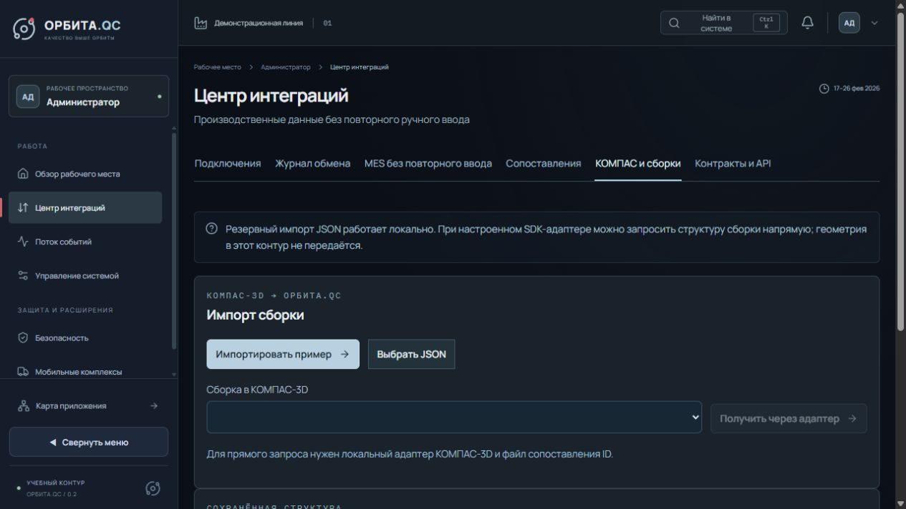

**Интеграции · Контракты и API**

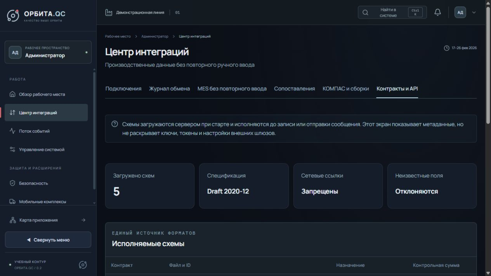

**Управление · Пользователи и роли**

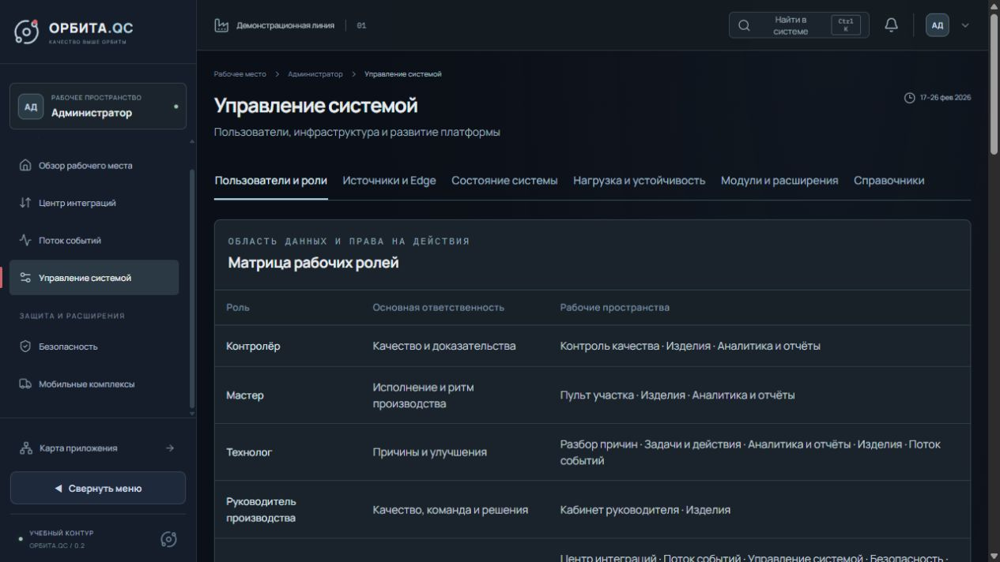

**Управление · Источники и Edge**

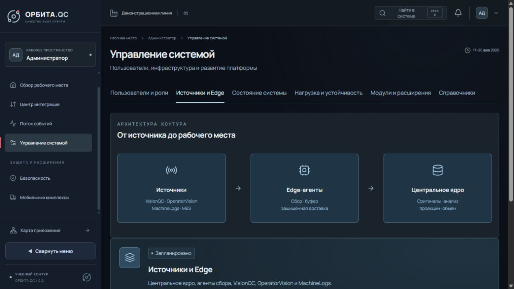

**Управление · Состояние системы**

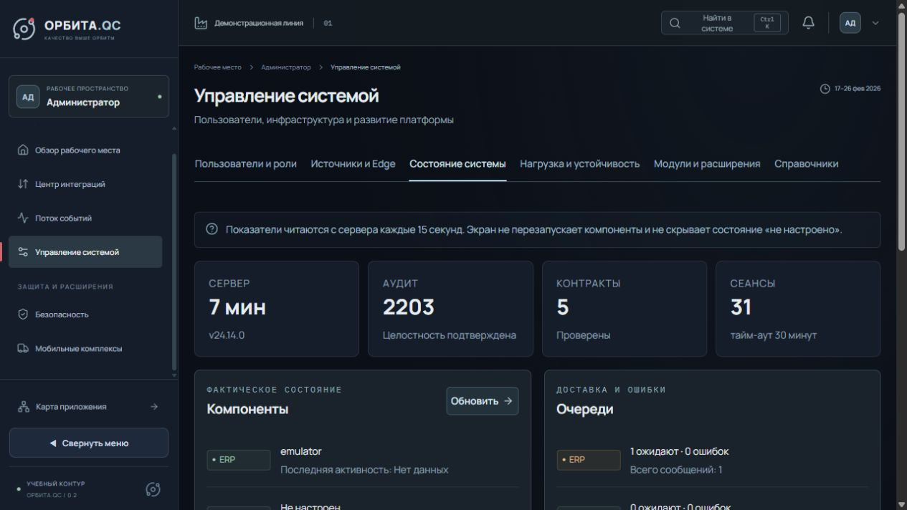

**Управление · Нагрузка и устойчивость**

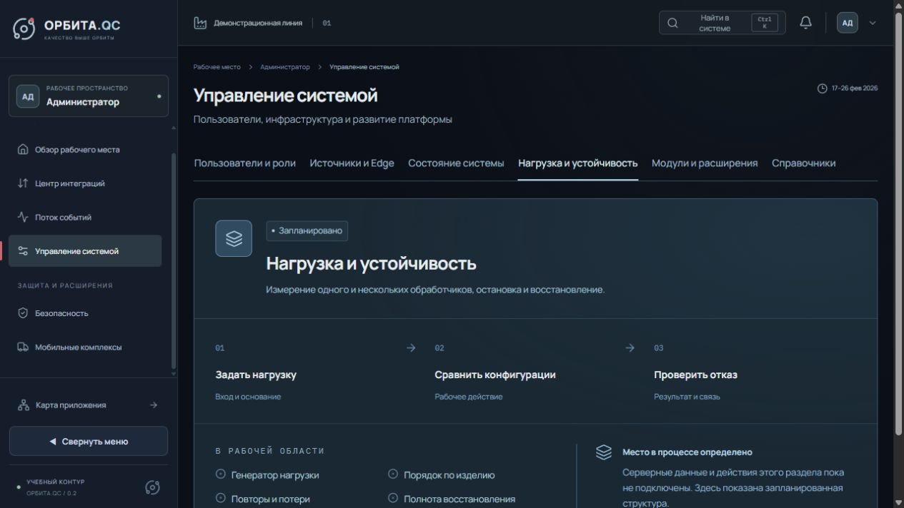

**Управление · Модули и расширения**

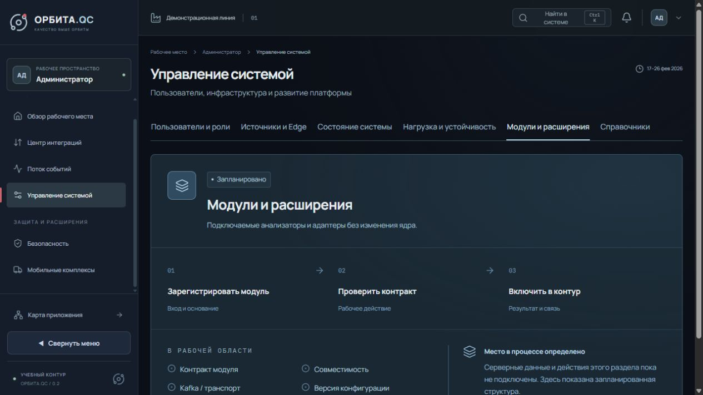

**Управление · Справочники**

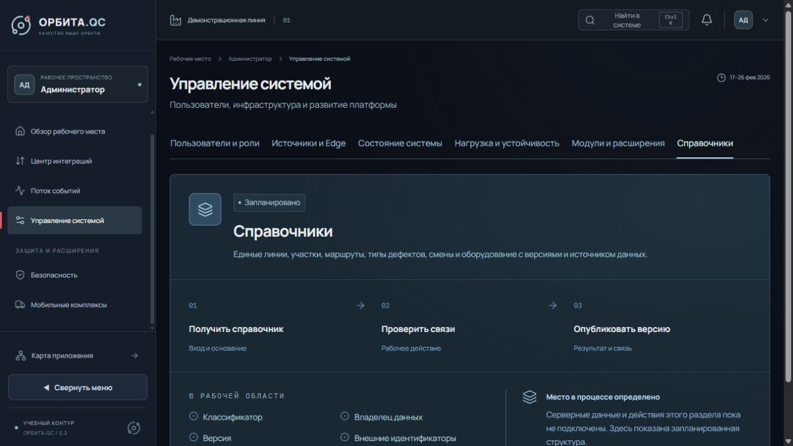

**Безопасность · Аудит действий**


**Безопасность · Целостность**

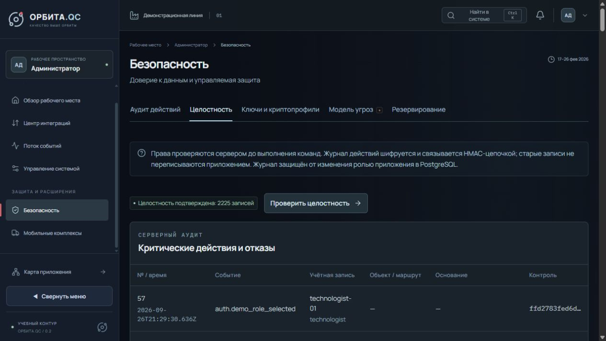

**Безопасность · Ключи и криптопрофили**


**Безопасность · Модель угроз+**


**Безопасность · Резервирование**


**Мобильные комплексы · Задания**


**Мобильные комплексы · Комплексы**


**Мобильные комплексы · Связь и синхронизация**


</details>

### Общие пространства: найти изделие и проверить источник


| Раздел / вкладка | Для чего нужен и что реализовано | Экран |
| --- | --- | --- |
| Изделия · Реестр | Общий для контролёра, мастера, технолога и руководителя список изделий с поиском и переходом к паспорту. | [Открыть](docs/screenshots/products.png) |
| Поток событий · Журнал | Технолог и администратор видят оригинальные факты, источники, время события и доставки. | [Открыть](docs/screenshots/events-journal.png) |
| Поток событий · Качество данных | Учебная проверка задержки, дубля и перестановки пакетов на отдельном расписании; исходная история не изменяется. | [Открыть](docs/screenshots/events-quality.png) |
| Поток событий · Сценарии и воспроизведение | Квитанции приёма, поздние пакеты, дубли и карантин. Сервер разрешает загрузку внешних сообщений администратору. | [Открыть](docs/screenshots/events-replay.png) |
| Карта приложения · Все пространства | Навигационная карта пяти рабочих мест помогает понять границы ответственности. | [Открыть](docs/screenshots/guide-map.png) |
| Карта приложения · Как это работает | Объясняет связи наблюдения, факта, причины и действий ролей. | [Открыть](docs/screenshots/guide-workflow.png) |
| Карта приложения · Справка | Словарь понятий, состав данных и границы текущей версии. | [Открыть](docs/screenshots/guide-help.png) |

<details>
<summary>Посмотреть все экраны этого рабочего места</summary>

**Изделия · Реестр**


**Поток событий · Журнал**


**Поток событий · Качество данных**


**Поток событий · Сценарии и воспроизведение**


**Карта приложения · Все пространства**


**Карта приложения · Как это работает**


**Карта приложения · Справка**


</details>

## Архитектура

Приложение запускается в Docker. Текстовые и численные данные, решения, сеансы и очередь обмена хранятся в PostgreSQL; фотографии — в отдельном экземпляре PostgreSQL. Интерфейс получает состояние через HTTPS API. Изменение карточки в браузере становится производственным фактом только после серверной проверки и фиксации транзакции.


```mermaid
flowchart TB
  Browser["Ролевые рабочие места: React"] --> Web["Nginx: HTTPS и балансировка"]
  Web --> API1["API replica 1"]
  Web --> API2["API replica N"]
  API1 --> Policy["Контракты, RBAC и переходы"]
  API2 --> Policy
  Sources["CV, MES, станки и MobileOps"] --> Policy
  Secrets["Секреты и keyring"] -.-> Policy
  Policy --> DB["PostgreSQL: события, решения, аудит и outbox"]
  Policy --> Media["Media PostgreSQL: фотографии"]
  DB --> Workers["Очередь доставки: lease и retry"]
  Workers --> Adapters["Адаптеры ERP, MES и CAD"]
  Adapters --> ERP["ERP-эмулятор или шлюз предприятия"]
  ERP --> Adapters
  DB --> Backup["Зашифрованная копия и проверка восстановления"]
  Media --> Backup
```

**Основная БД** хранит исходные сообщения отдельно от решений людей. Таблица `events` содержит принятые оригиналы; `ingest_receipts` — результат каждой доставки, включая ошибочную; `commands` — результаты идемпотентных команд; `journal` — связанные контрольными кодами записи; `outbox` — обязательства отправить результат. Производные очереди и показатели пересчитываются из истории.

**Media DB** имеет отдельный процесс, каталог данных и пароль. Изображение проверяется по сигнатуре формата и хешу, выдаётся только через API с проверкой доступной линии. В статическом веб-образе отсутствуют каталоги с фотографиями и исходными потоками. Между двумя БД нет распределённой транзакции: сначала сохраняется неизменяемый файл, затем ссылка. Сбой может оставить непривязанный файл, но не подтверждённое решение с несуществующим материалом.

**Надёжная команда** включает роль, изделие, основание, ревизию истории и `Idempotency-Key`. Сервер блокирует поток изделия на время транзакции, проверяет допустимый переход и сам создаёт события. Повтор с тем же ключом возвращает прежний результат; другое содержимое под этим ключом или устаревшая ревизия дают конфликт. Отправка в ERP выполняется после фиксации транзакции, поэтому недоступность ERP не отменяет локальное решение ОТК.

## Данные: происхождение и состав

Реальных выгрузок предприятия в репозитории нет. Исходный набор **синтетический**, создан воспроизводимыми генераторами в `quality_dataset`. Он моделирует необходимые виды данных и намеренно включает неполные сообщения, повторы, задержки и неоднозначные случаи. Снимки тоже синтетические; происхождение и описание генерации сохранены в [каталоге медиа](quality_dataset/media/PROMPTS.md).

Базовый расширенный набор содержит 180 изделий, 1955 уникальных событий, 2065 корректных доставок с 110 точными повторами, 30 некорректных доставок и 18 фотографий. Подготовка рабочего сценария отделяет внешние факты от действий людей и добавляет контекст для расследований. При первоначальном импорте текущего стенда получено 2157 событий; это другой срез, поэтому его нельзя напрямую сравнивать с числом внешних доставок генератора.

| Данные | Использование |
| --- | --- |
| Изделия, типы, компоненты, ревизии сборки, производственные заказы | Прослеживаемость и связь ERP, CAD, контроля и участка |
| Линии, станции, смены, контрольные точки | Область доступа, очередь рабочего места, сопоставление условий |
| Поступление, начало/окончание/пауза операции, отдельный `operation_run_id` | Хронология, повторные операции, длительности, незавершённая работа |
| Исполнитель, оборудование, действия оператора | Контекст расследования без автоматического назначения причины |
| Наблюдения до/после, качество обзора, три результата, уверенность и версия анализатора | Сравнение наблюдений и корректное представление неопределённости |
| Тип, компонент, зона и идентификатор признака | Объединение повторных наблюдений в случай, устранение двойного счёта |
| Фотографии, источник, этап, SHA-256, причина отсутствия | Проверяемые материалы и явное различие отсутствия файла и отсутствия дефекта |
| Решения ОТК с автором, временем, основанием и ссылками | Доработка, удержание, выпуск, карантин и списание как отдельные события |
| Работа мастера, повторный контроль, заключения о причине | Замкнутый цикл и сохранение истории исправлений |
| ID сообщения, версия схемы, время возникновения и серверного приёма | Дедупликация, поздние события, конфликтующие оригиналы и аудит доставки |

### Дополнительные сведения, которые стоит собирать

Один сигнал о дефекте не объясняет его возникновение. Поэтому модель включает дополнительные поля; отсутствие таких сведений остаётся видимым и не заполняется догадками.

| Дополнительные сведения | Практическая польза |
| --- | --- |
| Программа станка и её ревизия, инструмент, оснастка, изменения наладки | Позволяют отличить повторяемый дефект программы от износа или изменения установки |
| Обороты, подача, нагрузка шпинделя, вибрация, наработка инструмента | Дают контекст операции и позволяют проверять гипотезу на сопоставимых запусках |
| Состояние инструмента и оснастки со слов мастера | Связывают телеметрию с фактической ситуацией на участке |
| Ручной размер, единица, прибор, подтверждение поверки и документ критерия | Отделяют приборный контроль от визуальной оценки CV |
| Физическая локация и блокировка изделия | Помогают не потерять удержанную деталь между ОТК, буфером и доработкой |
| Метод, исполнитель, длительность, количество циклов доработки | Позволяют оценить потери времени и результативность исправлений |
| Запрошенные/недостающие факты, альтернативы, основания вывода | Делают расследование проверяемым и показывают границы уверенности |
| Квитанции обмена, число попыток, ревизии и ключи команд | Объясняют, что действительно сохранено и доставлено, а что требует восстановления |

Для реальной линии ID изделия читается сканером или приходит из MES; событие операции — из MES/журнала станка; наблюдение — из внешнего CV; структура изделия — из CAD/ERP. Человек вводит результат проверки и недостающие факты. Условные численные допуски и КД в наборе не являются производственными нормативами.

## Подключение предприятия

| Источник | Реализовано | Что требуется от предприятия |
| --- | --- | --- |
| ERP-эмулятор | Отдельный HTTPS-сервис, приём заданий, отправка качества, подтверждения и повтор без дублирования | Ничего для локального стенда |
| 1С и Галактика | Адаптеры шлюза, явное сопоставление внешних ID, версии контрактов, тайм-ауты, повторы и тесты | URL опубликованного шлюза, credentials, CA, таблица ID и согласованный контракт конкретной конфигурации |
| MES | Приём фактов операций и отправка сохранённых решений; состояние обмена в БД | Доступный HTTPS-шлюз и сопоставление идентификаторов |
| КОМПАС-3D | Импорт версионированной структуры сборки из JSON или SDK-шлюза, проверка конфликта ревизии | Установленный КОМПАС/SDK и локальный шлюз; передача геометрии не требуется |
| CV и MachineLogs | Версии событий 1.0/2.0, контроль обязательных полей и ссылок, сохранение оригинала | Источники и нормативные правила площадки; обучение CV в это приложение не входит |
| Мобильный инспекционный источник | Миссии, буфер наблюдений при разрыве связи, квитанции и идемпотентная доставка | Аппаратный драйвер, сеть и аттестация конкретной платформы |

Контракты шлюзов и переменные окружения: [ERP](app/ERP_АДАПТЕРЫ.md), [MES и КОМПАС](app/MES_КОМПАС_АДАПТЕРЫ.md), [MobileOps](app/MOBILEOPS_КОНТУР.md). Наличие адаптера не означает подключения к установленной на предприятии системе: для неё проводится отдельный приёмочный обмен.

## Безопасность и сохранность

- TLS на внешнем входе, между Nginx и API и между приложением и обеими БД. PostgreSQL отклоняет сетевые подключения без TLS.
- AES-256-GCM для содержимого событий, документов, сеансов, очереди и фотографий; HKDF разделяет назначение ключей. AAD связывает запись с её типом и идентификатором. Индексные ID и времена остаются открытыми для SQL-поиска.
- HMAC-цепочки по потокам, контроль конечных точек, SQL-права только на добавление истории и триггеры запрета UPDATE/DELETE/TRUNCATE. Администратор инфраструктуры с доступом ко всем ключам остаётся в модели угроз; для независимого доказательства нужны внешние подписанные контрольные точки/WORM.
- Пароли хешируются scrypt; сеансы общие для реплик, имеют срок жизни, тайм-аут и отзыв. Cookie — Secure, HttpOnly, SameSite; команды защищены CSRF, проверкой Origin, роли, линии и версии истории.
- Ограничения размера запросов, частоты, пула соединений и ресурсов контейнера. API работает непривилегированным пользователем с read-only root filesystem; каждому сервису монтируются только необходимые секреты.
- Ротация keyring сохраняет старые версии для чтения истории. Ключи не включаются в резервную копию данных и должны резервироваться отдельно.

Для долгосрочного архивирования реализован отдельный проверяемый профиль **X25519 + ML-KEM-768 → HKDF-SHA256 → AES-256-GCM**. Он доступен через `scripts/archive-crypto.mjs`, сохраняет ссылку на оригинал и проверяет повреждение/недоступность ключа. Это прикладной архивный формат, а не заявление о постквантовой защите TLS или сертификации криптографии. Команды и ограничения — в [эксплуатации](docs/operations.md).

## Масштабирование и нагрузка

Публичный стенд размещён на Ubuntu 24.04 с 1 vCPU и 2 ГБ RAM: один API, две БД, ERP-эмулятор и веб-контейнер. Перед ними работает HTTPS-вход с сертификатом Let’s Encrypt. Это компактная демонстрационная конфигурация; ниже описан способ увеличения ресурсов и числа экземпляров. [Размещение и обслуживание стенда](docs/stand.md).

Приложение подготовлено к нескольким API: сеансы, команды, блокировки и очередь находятся в общей БД. Nginx распределяет запросы без привязки пользователя к экземпляру. `SKIP LOCKED` и аренда задания позволяют нескольким работникам разбирать очередь; повтор после потери подтверждения использует тот же идентификатор результата. Порядок решений одного изделия сохраняется отдельно для каждого получателя.

```sh
docker compose up -d --no-build --scale api=4
```

**Вертикальное масштабирование:** лимиты CPU/RAM контейнеров и размер пула вынесены в Compose; для БД настраиваются память, число соединений и дисковый ресурс. Основная и медиа-БД могут получать ресурсы независимо.

**Горизонтальное масштабирование:** добавление API повышает доступную вычислительную ёмкость и позволяет пережить остановку экземпляра. Производственные сообщения и решения блокируются по изделию, а не одной глобальной блокировкой. Проверка курсора избавляет регулярный опрос интерфейса от повторной передачи неизменившейся истории. Для реального несколькихостового размещения нужны общий адрес PostgreSQL, централизованные секреты и внешний балансировщик.

Рост числа реплик не равен бесконечной производительности. Полная история пока пересчитывается при изменении; адаптеры прежнего формата сериализуют своё состояние одной блокировкой. Следующие измеряемые границы роста — серверные проекции и пагинация, разбиение состояния адаптеров по получателю, партиционирование истории и отдельное объектное хранилище для больших объёмов медиа. Сумма пулов всех реплик должна оставлять запас в `max_connections`; текущая настройка не рассчитана на неограниченное число API.

Одноузловой Compose не обеспечивает HA самих PostgreSQL, Nginx и диска. Для SLA предприятия требуются репликация/автоматическое переключение БД, резервирование входа, PITR и независимое резервное хранилище. [Протокол проверок](docs/verification.md) отделяет выполненные испытания от дальнейшей приёмки под конкретную нагрузку.

## Проверки и разработка

Разработка: Node.js 24.14+, pnpm 11.25. Версия Node важна для ML-KEM. JSON Schema и политика ролей служат источниками генерируемых типов/серверных разрешений; проверка дрейфа отклоняет устаревший сгенерированный файл.

```sh
cd app/source
pnpm install --frozen-lockfile
pnpm contracts:check
pnpm test
pnpm test:crypto
pnpm security:scan
pnpm build
```

На поднятом стенде из корня:

```sh
docker compose run --rm --no-deps api node --test server/tests/database.test.mjs server/tests/crypto.test.mjs
docker compose exec -T api node scripts/verify-outbox.mjs
```

HTTPS smoke проверяет роли, запреты, CSRF, защищённое медиа, приём сообщений, ERP, сохранение настроек, конфликты версий и копию. Он создаёт тестовые квитанции и материалы; запускать его на стенде, а не поверх рабочей производственной истории.

```powershell
$env:TEST_CA_FILE = "$PWD/.secrets/ca.crt"
$env:LOAD_REQUESTS = '100'
$env:LOAD_CONCURRENCY = '10'
node app/source/scripts/smoke-production.mjs
```

## Быстрый старт

Потребуются Git, Docker с Linux containers и Compose v2, OpenSSL. На Windows используется PowerShell 7. Для запуска контейнеров локальные Node.js, Python и PostgreSQL не нужны. Для комфортной работы стенда выделите Docker около 6 ГБ памяти; фактическую потребность проверяйте под своей нагрузкой.

### Windows

Клонируйте репозиторий на диск A в каталог с латинским именем: это исключает проблемы Docker Desktop с кириллицей в пути сборки.

```powershell
git clone git@gitverse.ru:hackrus.experts/kosmo-moskva_r2_negative_9.git A:\orbita-qc
cd A:\orbita-qc
pwsh -File deployment/start.ps1 -Replicas 2
```

Если OpenSSL отсутствует в PATH, укажите установленный исполняемый файл:

```powershell
pwsh -File deployment/start.ps1 -OpenSsl 'C:\Program Files\OpenSSL-Win64\bin\openssl.exe'
```

### Linux

```sh
git clone git@gitverse.ru:hackrus.experts/kosmo-moskva_r2_negative_9.git orbita-qc
cd orbita-qc
sh deployment/start.sh
```

Откройте **https://localhost:8443**. Генератор создаёт локальный CA и сертификаты; браузеру требуется доверие к этому CA. Проверяйте, что сертификат относится к вашему стенду. Для предприятия используются сертификаты его PKI. Проверка TLS между контейнерами включена, отключать её для запуска не требуется.

При первом запуске скрипт создаёт CA с разрешением на подпись серверных сертификатов, а готовность PostgreSQL проверяется по TCP после инициализации. Если `.secrets` была создана старой версией скрипта, сертификаты автоматически не заменяются: сохраните ключи и данные, прежде чем перевыпускать их. Не удаляйте `.secrets` и `.runtime` для устранения ошибки запуска.

```sh
docker compose ps
docker compose logs --tail 100 api
docker compose stop
docker compose up -d --no-build --scale api=2
```

Первый запуск импортирует исходный набор один раз. Повторный запуск сохраняет решения. Каталоги `.runtime/postgres`, `.runtime/media-postgres` и `.runtime/backups` находятся рядом с проектом; при размещении проекта на A прикладные данные также остаются на A. Образы и служебные файлы Docker располагаются согласно настройкам Docker Desktop.

Параметры входа и переключение режима описаны в [документации бэкенда](app/source/server/README.md). Ключи и первоначальные учётные данные генерируются в `.secrets` и не входят в Git.


## Структура репозитория

```text
app/
  contracts/              JSON Schema и политика ролей
  *.mjs                   адаптеры протоколов и модули совместимости
  source/
    src/                  React, доменная проекция, ролевые рабочие места
    server/               HTTPS API, PostgreSQL, аудит, очередь, криптография
      migrations/         схема БД и ограничения неизменяемости
      tests/              проверки реальной БД и криптографии
    scripts/              сборка, codegen, smoke, ротация и архивирование
    tests/                доменные, контрактные и интеграционные тесты
    public/               шрифты и исходные синтетические медиа для импорта
  licenses/               лицензии используемых компонентов
quality_dataset/          генераторы, исходные наборы, сценарии и эталоны
deployment/               запуск, TLS, PostgreSQL, Nginx и проверка восстановления
docs/                     эксплуатация, протокол испытаний, снимки экранов
Dockerfile                сборка API и веб-интерфейса
compose.yaml              локальный стенд
compose.production.yaml   настройки режима эксплуатации
```

Архивы релизов, встроенный `node.exe`, собранный сайт, логи, базы, пароли и ключи не нужны в исходном дереве. Сборочные артефакты воспроизводятся из lockfile. Перед вводом в эксплуатацию согласуются реальные допуски и полномочия, интеграционные ID, хранение фото, часы источников, нагрузочный профиль и процедуры восстановления; синтетический набор заменяется проверенными данными площадки.

## Лицензия

Исходный код проекта распространяется по [лицензии MIT](LICENSE). Лицензии сторонних компонентов собраны отдельно в `app/licenses/`.
