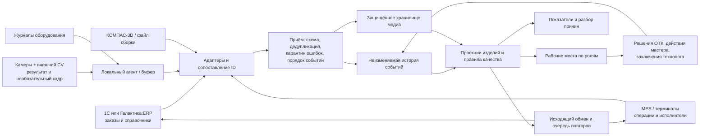

# Откуда берутся данные и как устроить целевую систему

Это проектное предложение для предприятия, а не утверждение о действующих системах РКК «Энергия». ТЗ разрешает команде самостоятельно определить формат и источники данных, а реальные производственные данные не предоставляет. Внешний комплекс камер и CV считаем отдельным «чёрным ящиком»: наше ядро принимает уже подготовленные результаты. Фотографии могут прилагаться, но работа системы от них не зависит.

## Минимум для работы и полезное расширение

| Данные | Зачем контролёру и технологу | Как получать без тяжёлого ручного ввода | Если недоступны |
| --- | --- | --- | --- |
| ID изделия/компонента, заказ, партия поставки, редакция маршрута/сборки | Не спутать похожие детали и версии, отличить входной дефект от производственного; увидеть повторяемость по партии | Скан кода изделия при передаче участка; справочники и заказ из ERP/MES; структуру сборки через файл или адаптер КОМПАС-3D | Событие отправляется в разбор идентичности; нельзя «угадать» изделие по похожему фото |
| Выполнение операции (`operation_run_id`), начало/конец, участок, исполнитель, оборудование | Понять интервал возникновения, длительность, повторную обработку и сопоставимые случаи | Существующие отметки MES/терминала участка; для доработки — новый запуск со ссылкой на исходный | Отсутствующее поле явно отмечать; длительность не вычислять из непарных отметок |
| Контрольная точка, результат `signs_detected` / `no_signs_detected` / `unable_to_assess`, вид и область дефекта, уверенность, качество наблюдения | Быстро отсортировать очередь, сравнить состояния до и после; не принять плохой кадр за норму | Структурированный результат внешнего CV-анализатора или ручной контроль в интерфейсе ОТК | Назначить дополнительную проверку; уверенность не заменять нулём или вымышленным числом |
| Краткое описание видимого признака, предыдущее наблюдение и предложенная проверка | Дать контролёру осмысленный контекст без снимка, указать интервал появления; технолог видит, с чем сопоставлять журнал операции | Текст/код признака отдаёт внешний анализатор; приложение автоматически поднимает предыдущую контрольную точку и формирует ссылку на неё. Правило следующего контроля задаёт технологический маршрут | Отметить, что описание не передано; без кадра или очного контроля не подтверждать дефект автоматически |
| Ссылка на кадр, источник, ракурс, рецепт света, версия калибровки, контрольный хеш файла | Проверить основание сигнала, сравнить одинаковые ракурсы, отличить блик от дефекта, обнаружить подмену файла | Камера уже знает свой ID, время, пресет и ссылку на файл; агент прикладывает метаданные автоматически | Карточка работает без медиа и честно показывает причину отсутствия |
| Парные слоты `before_operation` / `after_operation` со статусом доставки | Отличить существовавший входной дефект от нового после станка; показать потерянный или закрытый кадр без подмены | Edge-агент передаёт ссылку и SHA-256 только при разрешённой доставке; при потере или ограничении доступа сообщает причину | `url: null`, пустой хеш и явный статус `MISSING`; решение требует очной проверки |
| Оценки длины/ширины признака и учебный `kd_spec` | Быстро сравнить сигнал с классом зоны и понять, какой документ нужен контролёру | Калиброванный CV-контур даёт оценку в мм и погрешность; реальный предел берётся из утверждённой КД с редакцией | Без калибровки или документа численный допуск не подставлять; глубину обычного кадра оставлять `null` |
| Физическая локация и блокировка движения изделия | Видеть, удержана ли деталь на посту, в буфере или передана дальше | MES/сканирование переходов и событие решения ОТК; в демо это снимок состояния на момент события | Последнее состояние помечать как неизвестное, не выводить из будущих событий |
| Программа станка, её версия, инструмент, приспособление, коды предупреждений и небольшой агрегат телеметрии | Технолог ищет повторение условий и формирует проверяемую гипотезу; мастер видит, какой участок проверить | Считать только поля, которые реально публикует CNC/MES; брать события/краткие окна из существующего журнала, не собирать постоянно весь сырой поток | Хранить `null` с причиной «источник не передал»; отсутствие данных не объявлять исправной работой станка |
| Решение ОТК, автор, основание, действие и повторная проверка | Отличить признак от подтверждённого несоответствия; сохранить доказательную историю | Короткая форма в рабочем месте контролёра с обязательной ссылкой на наблюдение и причиной | Не подставлять автоматическое подтверждение |
| Задание мастеру, новый запуск доработки, фактическое завершение, фото результата | Видеть физическое действие и задержку; не путать выполненную работу с допуском | Терминал участка или мобильная форма: начало/конец, исполнитель, короткий результат, фото при необходимости | Задача остаётся открытой; отсутствие фото не скрывается |
| Заключение технолога для нестандартной доработки или разбора причины | Не списывать ремонтопригодное изделие и не дорабатывать то, что нарушит допуски; исследовать связь дефекта с процессом | Подключать технолога по правилу маршрута или запросу специалиста; ссылка на редакцию чертежа/техпроцесса | Типовая разрешённая операция идёт по утверждённому маршруту; при отсутствии нужного заключения изделие удерживается |
| Ручной результат прибора, ID средства измерения, срок калибровки, допуск из документа | Подтвердить размер, который нельзя обосновать обычной фотографией | Импорт результата прибора, если он цифровой; иначе одна форма измерения контролёра с обязательным прибором | Указать «не измерено» и удерживать изделие, если размер нужен для решения |

Дополнительные поля мы добавили ради **контекста и обоснованности**, а не ради количества столбцов. В демонстрационном наборе инструмент/исполнитель иногда отсутствует, кадр иногда теряется, а тревога станка иногда совпадает с дефектом. Алгоритм обязан сохранить неопределённость. Значения толщины, допусков, телеметрии и решение о ремонтопригодности в наборе условны; в реальном внедрении их берут только из утверждённой документации и доступных источников.

## Предлагаемый путь данных

1. **На участке:** агент принимает результаты камеры и журналы, временно буферизует их при потере связи. Снимки остаются в защищённом медиа-хранилище, через события передаются ссылки и хеши. Пропуск кадра не блокирует приём структурированного результата.
2. **При входе в ядро:** схема и справочники проверяются; точный повтор `event_id` с тем же содержимым не учитывается второй раз. Тот же ID с другим содержимым, неизвестная деталь, неверная версия или недостающие обязательные поля уходят в карантин входа с причиной. Исходное сообщение сохраняется для аудита.
3. **После приёма:** события хранятся отдельно от вычисленного текущего состояния. Проекции по изделию пересчитываются по времени возникновения и связям с выполнением операции; фиксируются также время поступления и задержка. При исправлении добавляется новое событие, старое не переписывается.
4. **Правила качества:** внешний CV выдаёт признак, система собирает контекст и рекомендует приоритет проверки. Контролёр подтверждает или отклоняет результат и фиксирует решение после повторного контроля. Мастер организует действия участка и сообщает об их выполнении. Технолог анализирует обстоятельства и подключается к нестандартной доработке, когда необходимо оценить её допустимость. Причина дефекта и ошибка оператора имеют самостоятельные статусы.
5. **После решения:** задача мастеру и повторный контроль создаются из маршрута качества; результат уходит во внешний эмулятор с идемпотентным ключом и подтверждением приёма. Ошибка обмена не стирает локальное решение.

## Интеграция в реальном проекте

- **1С / Галактика:ERP:** получать производственное задание и справочники; передавать итог контроля с ID изделия, заказа, статусом, временем решения и ссылкой на основание. Конкретный API зависит от установленной конфигурации. В MVP обязателен один двусторонний обмен с эмулятором; он уже находится в малом наборе `dataset/integration/`.
- **MES:** получать реальные отметки операций, исполнителей и оборудования без повторного ввода. Передавать удержание/допуск и задачу на доработку по согласованному контракту.
- **КОМПАС-3D:** пока использовать версионированный файл условной сборки, затем адаптер API/SDK для структуры и редакции. По фото без калибровки не определять геометрический допуск.
- **Внешний CV и MachineLogs:** отделить транспорт/формат источника от правил ядра. Контракт версии `2.0` расширяет прежний `1.0`; оба формата читаются адаптером, а внутри приводятся к общей модели.

Разграничение доступа: контролёр принимает решения о качестве, мастер фиксирует выполнение на участке, технолог даёт заключение, руководитель читает аналитику, администратор управляет источниками и доступом. Исходные события и материалы защищаются шифрованием, контрольными хешами и аудитом действий; ключи хранятся вне кода. Для ресурсов медиа нужны сроки хранения, резервирование и запрет бесконтрольной выгрузки — это определяется с заказчиком.

## Что рекомендуем согласовать с предприятием первым

1. Один реальный тип изделия и 2–3 контрольные точки, где камера видит одну и ту же поверхность до и после операции.
2. Какие ID уже есть на детали, в MES, ERP и журналах станка; правила сопоставления и кто считается источником истины.
3. Какие дефекты реально видимы камерой, какие требуют прибора, какие допускают доработку; пороги и порядок выпуска устанавливают специалисты предприятия.
4. Доступность журналов станка, версий программ/инструмента и связи с выполнением операции. Если этих данных нет, оставить поля необязательными.
5. Право на снимки, срок хранения, доступ к ним и условия разметки/подтверждения для будущей настройки внешнего CV. Версии анализатора проходят проверку на локальных данных, утверждение человеком и возможность возврата к прежней версии.

Эти вопросы позволяют заменить эмуляторы настоящими источниками без переделки логики истории, решений и аналитики.
